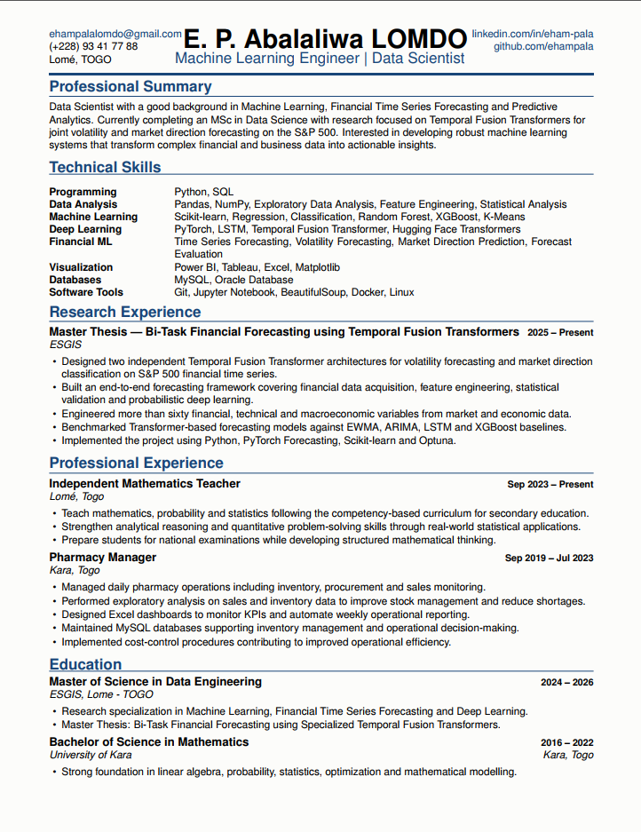
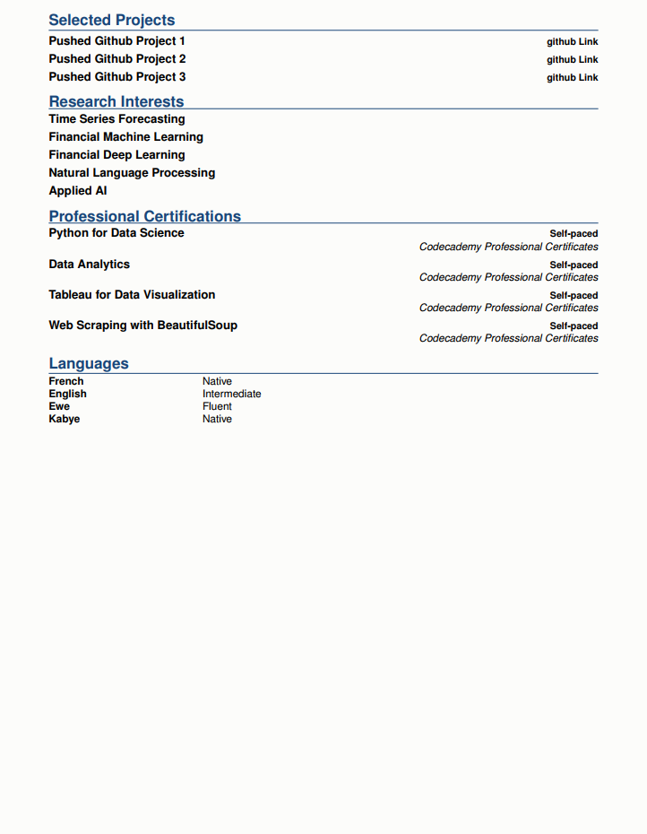

# Eham Pala Abalaliwa LOMDO — Data Scientist Resume

<p align="center">

**Machine Learning Engineer | Data Scientist | Financial Machine Learning**

📍 Lomé, Togo
📧 ehampalalomdo@gmail.com
💼 [LinkedIn](https://www.linkedin.com/in/eham-pala-abalaliwa-lomdo-831568264)
💻 [GitHub](https://github.com/ehampala)
<a aria-label="Chat on WhatsApp" href="https://wa.me/22893417788"> 

</p>

---

## About

Welcome to my professional resume repository.

This project contains the complete LaTeX source code of my resume, designed for **Machine Learning**, **Data Science**, and **AI Engineering** opportunities.

The resume is fully modular, ATS-friendly, and optimized for technical recruitment processes. It highlights my background in **Mathematics**, **Machine Learning**, **Financial Time Series Forecasting**, **Deep Learning**, and **Predictive Analytics**.

Beyond serving as a resume, this repository is also the foundation of my professional portfolio.

---

## Resume Preview





---

# Core Expertise

- Machine Learning
- Deep Learning
- Financial Machine Learning
- Time Series Forecasting
- Statistical Modeling
- Predictive Analytics
- Natural Language Processing
- Data Visualization
- Python Development

---

# Technical Stack

### Programming

- Python
- SQL

### Machine Learning

- Scikit-learn
- XGBoost
- Random Forest
- Support Vector Machines
- Clustering

### Deep Learning

- PyTorch
- TensorFlow
- Hugging Face Transformers
- Temporal Fusion Transformers (TFT)

### Data Analysis

- Pandas
- NumPy
- Feature Engineering
- Statistical Analysis
- Exploratory Data Analysis

### Data Visualization

- Power BI
- Tableau
- Matplotlib

### Databases

- MySQL
- Oracle Database

### Tools

- Git
- GitHub
- Jupyter Notebook
- BeautifulSoup

---

# Research Interests

My current research focuses on:

- Financial Machine Learning
- Time Series Forecasting
- Deep Learning
- Transformer Architectures
- Volatility Forecasting
- Algorithmic Trading
- Quantitative Finance
- Natural Language Processing

---

# Repository Structure

```text
.
├── abalaliwa_resume.tex
├── _header.tex
├── EPALresume.sty
│
├── assets/
│   ├── v1/
│
├── sections/
│   ├── objective.tex
│   ├── skills.tex
│   ├── research.tex
│   ├── projects.tex
│   ├── experience.tex
│   ├── education.tex
│   ├── certifications.tex
│   └── languages.tex
│
└── README.md
```

---

# Features

- ATS-friendly layout
- Clean and minimalist design
- Modular LaTeX architecture
- Easily customizable
- Optimized for Data Science & Machine Learning applications
- Compatible with Overleaf
- Easy to maintain over time

---

# Build

Compile locally using:

```bash
pdflatex abalaliwa_resume.tex
```

or simply upload the project to **Overleaf**.

---

# Future Improvements

This repository will continue to evolve with:

- New Machine Learning projects
- Research publications
- Conference presentations
- Open Source contributions
- Kaggle competitions
- Professional certifications

---

# Acknowledgements

This project is based on the excellent **Data Science Resume Template** created by **Timmy Chan**.

The original template has been extensively redesigned and customized to better reflect my professional profile and career objectives.

Original project:

https://github.com/TimmyChan/data-science-tech-resume-template

---

# Contact

I am always interested in discussing opportunities related to:

- Machine Learning
- Data Science
- Financial AI
- Quantitative Research
- Deep Learning
- Applied Artificial Intelligence

Feel free to connect with me on LinkedIn or GitHub.

---

<p align="center">

⭐ If you found this repository useful, feel free to star it.

</p>
